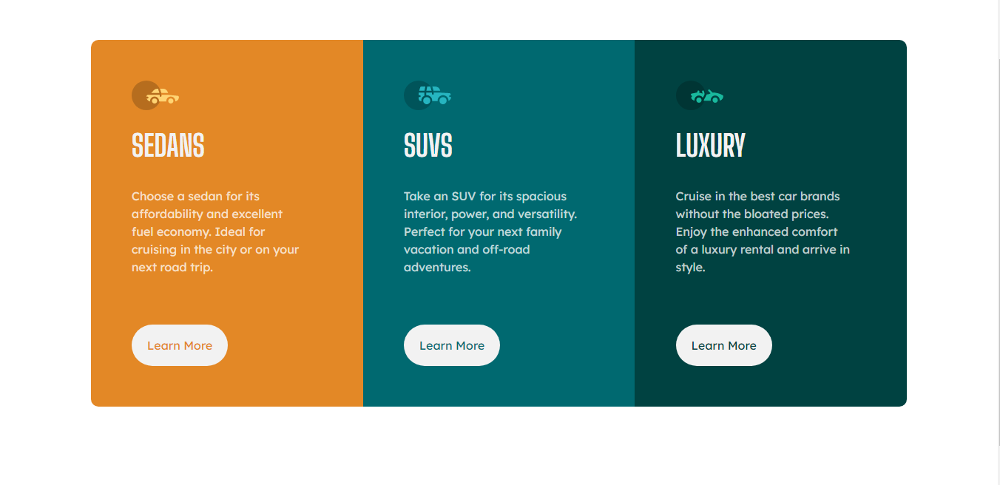

# Frontend Mentor - 3-column preview card component solution

This is a solution to the [3-column preview card component challenge on Frontend Mentor](https://www.frontendmentor.io/challenges/3column-preview-card-component-pH92eAR2-). Frontend Mentor challenges help you improve your coding skills by building realistic projects.

## Table of contents

- [Overview](#overview)
  - [The challenge](#the-challenge)
  - [Screenshot](#screenshot)
  - [Site Link](#links)
- [My process](#my-process)
  - [Built with](#built-with)
  - [What I learned](#what-i-learned)
  - [Useful resources](#useful-resources)
- [Author](#author)

## Overview

### The challenge

Users should be able to:

- View the optimal layout depending on their device's screen size
- See hover states for interactive elements

### Screenshot

### Links

- Solution URL: [Site Link](https://skanthanvijay.github.io/Frontend-Mentor-3-column-preview-card/)

## My process

### Built with

- Semantic HTML5 markup
- CSS custom properties
- Flexbox
- Bootstrap/CSS Grid
- Mobile-first workflow

### What I learned

This time, I made the code much more organized and clean compared to when doing my last project. I added comments to separate sections of code.

### Useful resources

- [The Complete Web Development Bootcamp](https://www.udemy.com/course/the-complete-web-development-bootcamp/) - This is the course I am using to learn web development.

## Author

Skanthan V.
- Frontend Mentor - [@yourusername](https://www.frontendmentor.io/profile/skanthanvijay)
